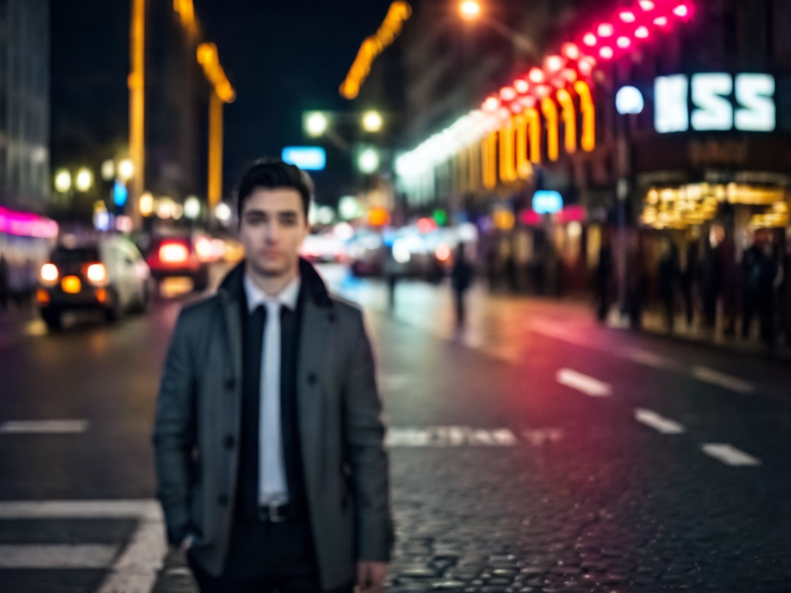
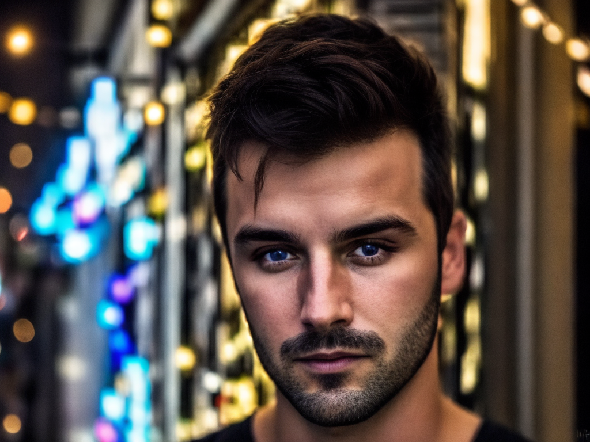
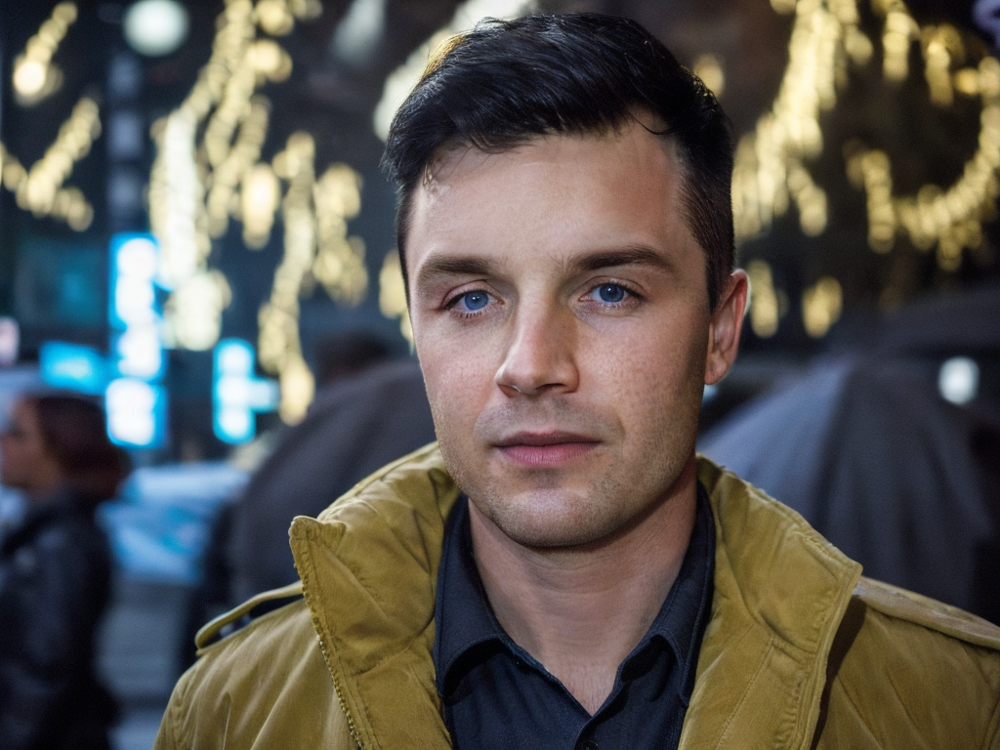
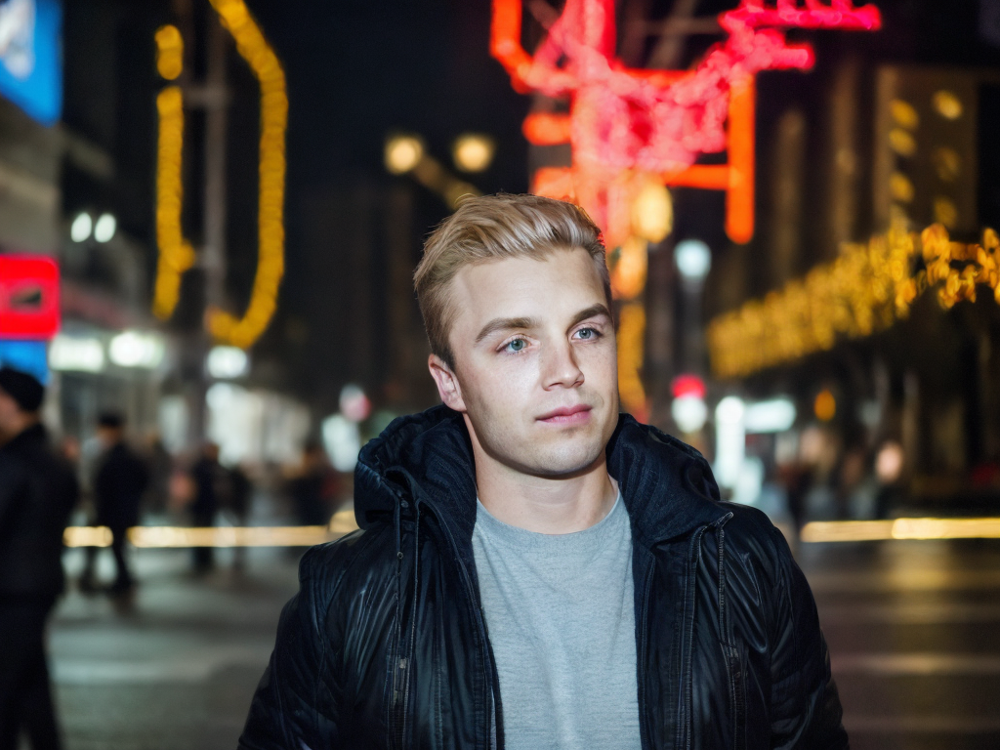

# Эксперименты по обучению модели Stable Diffusion 1.5

## Описание проекта

Проект включает анализ двух различных методов обучения для генерации лицевых изображений с использованием модели Stable Diffusion. Цель анализа - оценить, как изменение некоторых ключевых параметров обучения влияет на качество и эффективность генерации изображений.

## Параметры обучения

### Подход 1 

Модель дообучалась на 19 фото актера Noel Fisher:

1. **Изменение размера изображений**: Изображения сжимаются до размера 64x64 пикселей перед обучением, что может снизить качество детализации изображений.
   
2. **Gradient Accumulation Steps**: Задано значение 1, что означает обработку одного мини-пакета за шаг, потенциально увеличивающее шум обновлений весов.

3. **Checkpointing Steps**: Установлено в 200 шагов, что позволяет сохранять промежуточные модели чаще, полезно для более длительных тренировок или при ограниченных ресурсах.

## Результатом была размытая картинка, мужчина был не похож на обученного актера

### Подход 2

1. **Изменение размера изображений**: Изображения не сжимаются до меньшего размера, что помогает сохранить оригинальное качество и детализацию.

2. **Gradient Accumulation Steps**: Значение увеличено до 2, что позволяет модели обрабатывать два мини-пакета перед обновлением весов, уменьшая шум обновлений и потенциально улучшая качество обучения.

3. **Checkpointing Steps**: Установлено в 1000 шагов, что указывает на меньшую частоту сохранения промежуточных моделей, что может быть предпочтительнее при стабильных обучающих сессиях и достаточном количестве ресурсов.

## Технические параметры обучения

- **Resolution**: Оба подхода используют разрешение 512x512 пикселей для генерации изображений.
- **Batch Size**: Размер пакета установлен в 1 для обоих подходов.
- **Learning Rate**: Скорость обучения 5e-6 применяется в обоих случаях.
- **Scheduler**: Оба подхода используют константный планировщик.
- **Mixed Precision**: Используется "fp16" для ускорения обучения в обоих случаях.
- **Use 8-bit Adam**: Применяется для оптимизации памяти в обоих подходах.

## Результаты: четкая картинка, мужчина похож на актера

## Выводы

Эксперименты показали, что подход без уменьшения размера изображений и с более высоким значением градиентной аккумуляции способствует более качественной генерации изображений. Уменьшение размера изображений в первом подходе снижает детализацию, что негативно сказывается на качестве конечных изображений. Увеличение частоты сохранения промежуточных моделей в первом подходе может быть полезным в условиях нестабильных обучающих сессий, но это также увеличивает объем требуемого хранилища и может замедлить процесс обучения.

