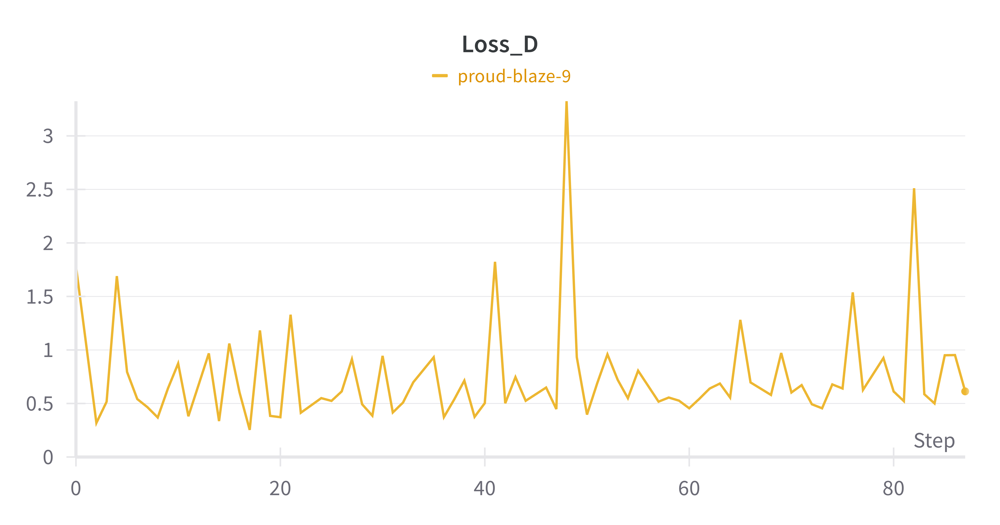
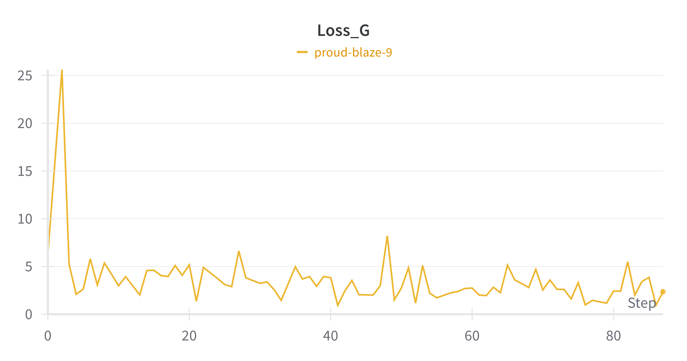
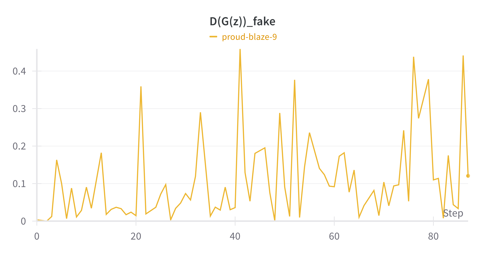
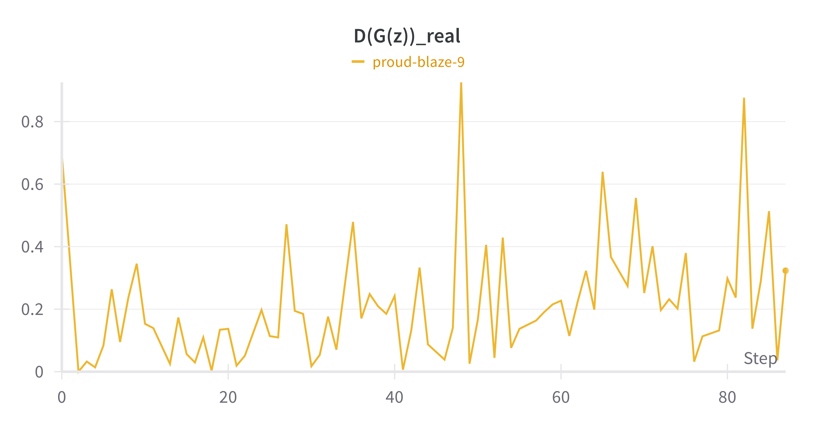
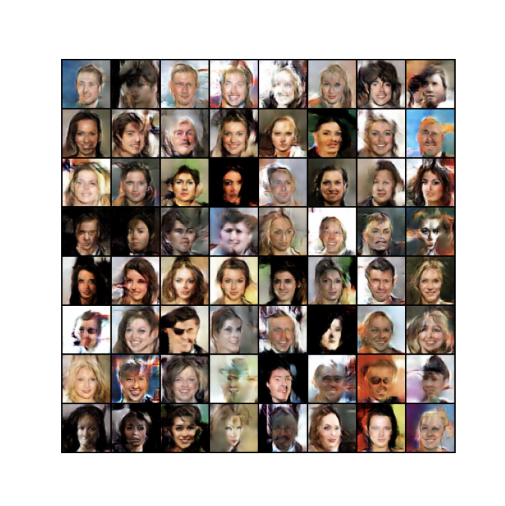
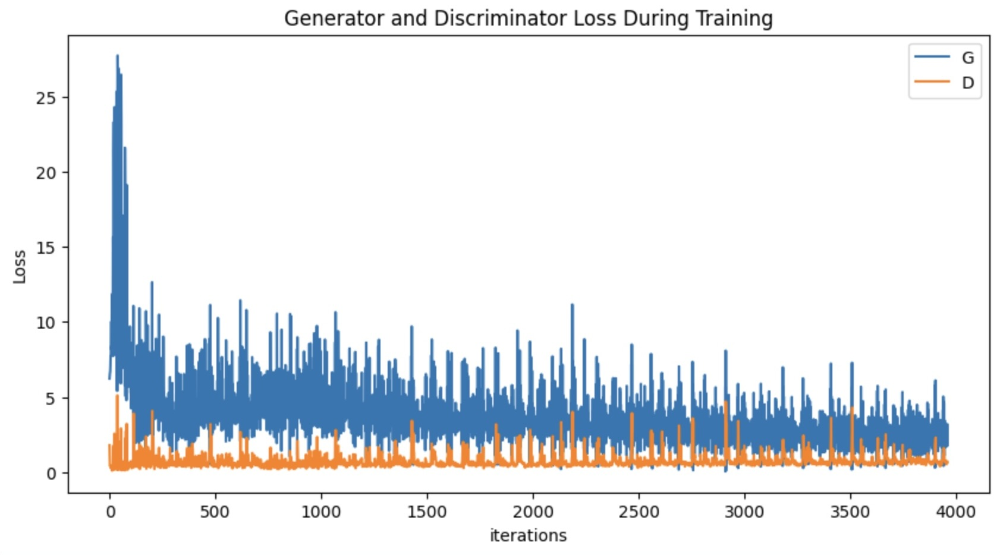

## Обзор проекта

Проект посвящен исследованию и оптимизации генеративно-состязательной сети (GAN), целью которой является генерация высококачественных визуальных изображений. В процессе работы над проектом были оптимизированы структуры как генератора, так и дискриминатора с целью улучшения качества генерируемых изображений и повышения эффективности обучения.

## Эксперименты и оптимизации

### Структура проекта

- **Generator**: Отвечает за создание изображений из случайного ввода (шума).
- **Discriminator**: Оценивает, является ли входное изображение реальным или сгенерированным генератором.
- **Training Loop**: Цикл обучения, в рамках которого осуществляется чередование обучения дискриминатора и генератора для достижения оптимальных результатов.

### Ключевые испытания и решения

В ходе работы над проектом были выявлены и успешно решены несколько задач:

1. **Проблема несоответствия размеров**: Одной из основных технических проблем стало несоответствие размеров выходных данных дискриминатора и соответствующих меток. Проблема была решена за счет корректировки использования метода `.view(-1)`, что позволило выравнить размеры и устранить конфликт.

2. **Оптимизация архитектуры сетей**: Для повышения качества генерируемых изображений и эффективности процесса обучения были предложены и внедрены изменения в архитектуру как генератора, так и дискриминатора. Эти изменения охватывали модификацию слоев, функций активации и стратегии обучения.

3. **Итеративная отладка и корректировка**: Важной частью процесса стала пошаговая отладка и корректировка кода, что включало исправление ошибок и неэффективных практик в расчете функций потерь и обработке данных.

## Экспериментальные результаты

Эксперименты с различными конфигурациями архитектуры и параметров обучения позволили значительно улучшить качество генерируемых изображений. В частности, было достигнуто уменьшение расхождения между распределениями реальных и сгенерированных данных, что подтверждается анализом лосс-функций и визуальным сравнением изображений до и после оптимизаций.

## Инструкции по запуску

1. **Установка зависимостей**:
   ```bash
   pip install -r requirements.txt
   ```
2. **Запуск ноутбука**:
   Откройте ноутбук проекта в среде, поддерживающей Jupyter Notebook или Google Colab, и последовательно выполните все ячейки.


## Анализ результатов и визуализация
Во время обучения GAN проводилось подробное логирование всех ключевых показателей, что позволило нам тщательно анализировать динамику и эффективность обучения. Все логи были сохранены и доступны через Wandb. Ниже представлены графики, демонстрирующие ключевые метрики в процессе обучения:

## Динамика потерь генератора и дискриминатора
Здесь показано, как менялась ошибка генератора (G) и дискриминатора (D) во времени. Идеальное сбалансированное обучение предполагает, что обе линии должны сближаться, но оставаться достаточно разделенными для эффективного обучения.





## Оценка реальности изображений

Эти графики показывают, насколько хорошо дискриминатор смог различать настоящие и сгенерированные изображения на разных этапах обучения. Чем выше значение, тем более уверенно дискриминатор распознает настоящие или сгенерированные данные.




## Итоговое качество сгенерированных изображений

Эти визуализации демонстрируют итоговое качество изображений, созданных генератором. Это позволяет наглядно оценить, насколько хорошо обучилась сеть.



Также, вы можете найти более подробную визуализацию здесь:

 ```
images/examples.gif
 ```

## Итоговая потеря обучения

Завершающий график потерь демонстрирует общую динамику изменения функции потерь как для генератора, так и для дискриминатора за все время обучения. Это позволяет оценить стабильность и эффективность процесса обучения.



