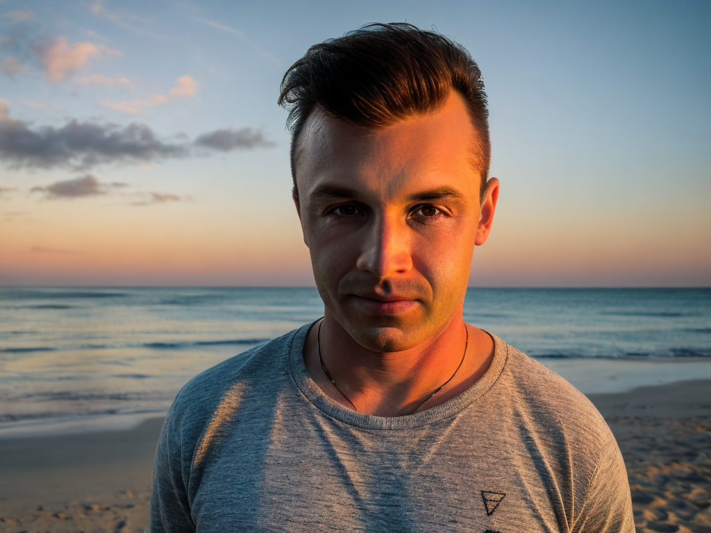

# Эксперименты по обучению модели Stable Diffusion 1.5

Notebook с экспериментами очень тяжелый, поэтому лежит тут: https://drive.google.com/file/d/1hRUwfdEBPcFOnvRTxlCta4Co0FfFh12E/view?usp=drive_link
:-)

## Описание проекта

Проект включает анализ двух различных методов обучения для генерации лицевых изображений с использованием модели Stable Diffusion. Цель анализа - оценить, как изменение некоторых ключевых параметров обучения влияет на качество и эффективность генерации изображений.

## Параметры обучения

### Подход 1 

Модель дообучалась на 19 фото актера Noel Fisher:


1. **Изменение размера изображений**: Изображения сжимаются до размера 64x64 пикселей перед обучением, что может снизить качество детализации изображений.
   
2. **Gradient Accumulation Steps**: Задано значение 1, что означает обработку одного мини-пакета за шаг, потенциально увеличивающее шум обновлений весов.

3. **Checkpointing Steps**: Установлено в 200 шагов, что позволяет сохранять промежуточные модели чаще, полезно для более длительных тренировок или при ограниченных ресурсах.

## Результатом была размытая картинка, мужчина был не похож на обученного актера


### Подход 2

1. **Изменение размера изображений**: Изображения не сжимаются до меньшего размера, что помогает сохранить оригинальное качество и детализацию.

2. **Gradient Accumulation Steps**: Значение увеличено до 2, что позволяет модели обрабатывать два мини-пакета перед обновлением весов, уменьшая шум обновлений и потенциально улучшая качество обучения.

3. **Checkpointing Steps**: Установлено в 1000 шагов, что указывает на меньшую частоту сохранения промежуточных моделей, что может быть предпочтительнее при стабильных обучающих сессиях и достаточном количестве ресурсов.

## Технические параметры обучения

- **Resolution**: Оба подхода используют разрешение 512x512 пикселей для генерации изображений.
- **Batch Size**: Размер пакета установлен в 1 для обоих подходов.
- **Learning Rate**: Скорость обучения 5e-6 применяется в обоих случаях.
- **Scheduler**: Оба подхода используют константный планировщик.
- **Mixed Precision**: Используется "fp16" для ускорения обучения в обоих случаях.
- **Use 8-bit Adam**: Применяется для оптимизации памяти в обоих подходах.

## Результаты: четкая картинка, мужчина похож на актера


## Выводы

Эксперименты показали, что подход без уменьшения размера изображений и с более высоким значением градиентной аккумуляции способствует более качественной генерации изображений. Уменьшение размера изображений в первом подходе снижает детализацию, что негативно сказывается на качестве конечных изображений. Увеличение частоты сохранения промежуточных моделей в первом подходе может быть полезным в условиях нестабильных обучающих сессий, но это также увеличивает объем требуемого хранилища и может замедлить процесс обучения.

### Сравнение чекпойнтов LoRA и U-Net

В этом документе представлено сравнение двух продвинутых технологий в области машинного обучения: LoRA (Low-Rank Adaptation) и U-Net. Оба чекпойнта использовались для тренировки моделей на задачах связанных с обработкой изображений и текста.

Всего было проведено 7 экспериментов, в которых настраивались такие параменты,как rank и learning rate. За подробстями об экспериментах приглашаю в ноутбук!

Далее представлено сравнение двух лучших чекпойнтов:

#### 1. Архитектура и настройка тренировки

**LoRA:**
- **Устройство:** CUDA (GPU)
- **Тип смешанной точности:** fp16
- **Количество примеров:** 20
- **Количество эпох:** 100
- **Размер батча:** 2 (с учетом распределения и аккумуляции)
- **Шаги аккумуляции градиента:** 2
- **Всего шагов оптимизации:** 1000
- **Логирование прогресса:** Прогресс сохранения чекпойнтов каждые 200 шагов с подробной информацией о сохранении различных состояний модели.

**U-Net:**
- **Устройство:** CUDA (GPU)
- **Тип смешанной точности:** fp16
- **Количество примеров:** 20
- **Количество эпох:** 100
- **Размер батча:** 2 (с учетом распределения и аккумуляции)
- **Шаги аккумуляции градиента:** 2
- **Всего шагов оптимизации:** 1000
- **Логирование прогресса:** Прогресс сохранения чекпойнтов каждые 1000 шагов с подробной информацией о сохранении состояний модели.

#### 2. Результаты тренировки

**LoRA:**
- **Потери при последнем сохранении:** 0.137
- **Общий прогресс:** 1000 шагов, снижение потерь на каждом шаге.

**U-Net:**
- **Потери при последнем сохранении:** 0.3
- **Общий прогресс:** 1000 шагов, стабильное снижение потерь с течением времени.

#### 3. Выводы и особенности использования

**LoRA:**
- Преимущество LoRA заключается в возможности адаптации к новым задачам с минимальными изменениями в исходной модели. Это делает LoRA особенно полезной для сценариев с ограниченными вычислительными ресурсами.
- LoRA показала более низкие потери по сравнению с U-Net при схожих условиях тренировки.

**U-Net:**
- U-Net остается мощным инструментом для задач сегментации, благодаря своей способности к точному анализу и восстановлению изображений.
- Хотя потери оказались выше, чем у LoRA, U-Net обеспечивает высокую точность в задачах, где это критически важно.

#### 4. Рекомендации

- **LoRA рекомендуется для быстрой адаптации моделей без значительных вычислительных затрат.**
- **U-Net рекомендуется для задач, где требуется высокая точность сегментации и восстановления деталей.**

Это сравнение показывает, что выбор между LoRA и U-Net должен основываться на конкретных требованиях и ресурсах проекта.

# Сгенерированные картинки Unet:


# Сгенерированные картинки LoRA:





### Использование ControlNet

В этом документе описывается процесс использования ControlNet, модели для генерации изображений.
#### Настройка среды

Перед началом работы убедитесь, что все необходимые библиотеки установлены и настроены:

```bash
!git clone https://github.com/huggingface/diffusers
%pip install git+https://github.com/huggingface/diffusers
```

#### Загрузка модели

Для использования ControlNet необходимо загрузить предобученную модель или инициализировать её с определёнными параметрами. Пример загрузки:

```python
from diffusers import StableDiffusionControlNetPipeline
from diffusers.utils import load_image

# Путь к вашей модели
model_path = "/path/to/your/model"

# Загрузка модели
pipe = StableDiffusionControlNetPipeline.from_pretrained(model_path)
pipe.to("cuda")  # Использование GPU для ускорения генерации
```

#### Генерация изображений

После загрузки модели вы можете использовать её для генерации изображений на основе текстовых подсказок:

```python
from PIL import Image
import torch

# Пример текстовой подсказки
prompt = "a fantasy landscape with mountains and a clear sky"

# Генерация изображения
with torch.no_grad():
    image = pipe(prompt=prompt).images[0]

# Сохранение или отображение изображения
image.save("generated_image.png")
Image.open("generated_image.png").show()
```

#### Оптимизация и настройки

Для улучшения производительности и качества изображений можно настроить параметры генерации:

```python
# Установка параметров генерации
pipe.enable_xformers_memory_efficient_attention()
pipe.scheduler = UniPCMultistepScheduler.from_config(pipe.config)

# Настройки для повышения качества изображения
image = pipe(prompt=prompt, num_inference_steps=50, guidance_scale=7.5).images[0]
```

#### Обработка ошибок и логирование

При работе с моделью важно обрабатывать возможные ошибки и настраивать логирование для отслеживания процесса:

```python
import logging

logging.basicConfig(level=logging.INFO)

try:
    image = pipe(prompt=prompt).images[0]
except Exception as e:
    logging.error(f"An error occurred: {e}")
```

# Сгенерированные картинки Controlnet:


